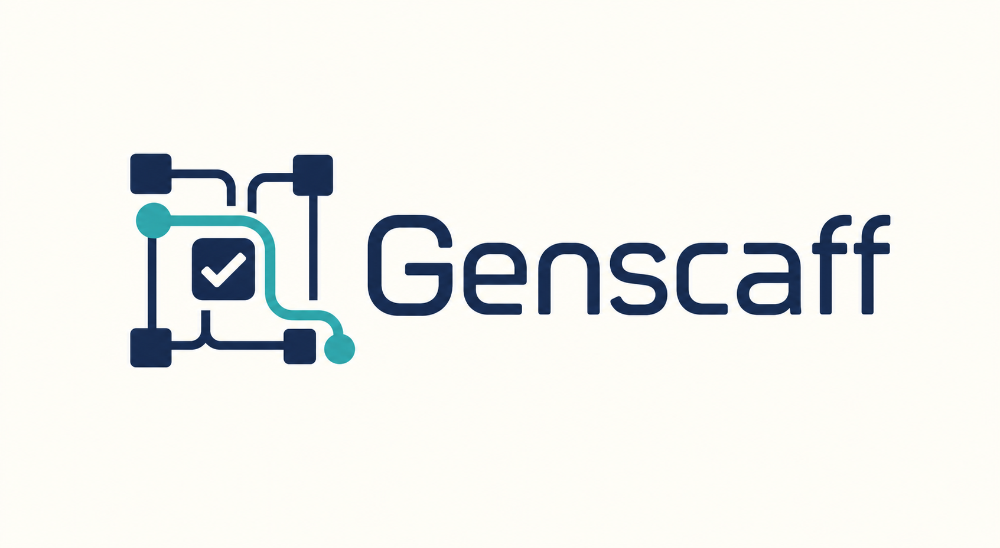
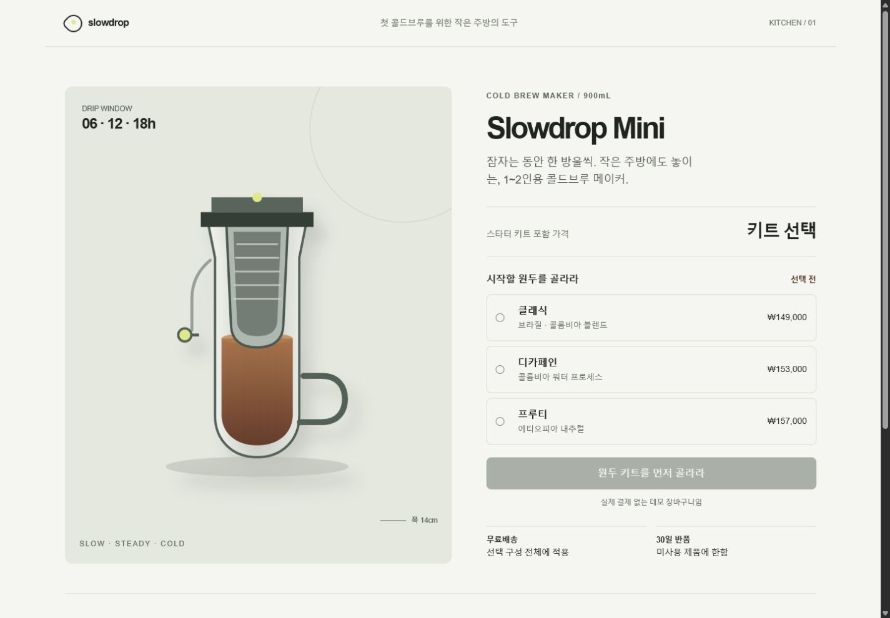
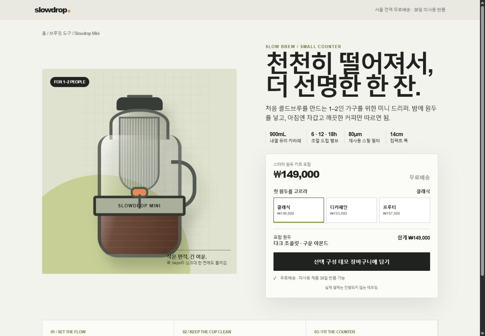

<p align="center"><picture><source media="(prefers-color-scheme: dark)" srcset="docs/assets/brand/genscaff-logo-dark.png"><source media="(prefers-color-scheme: light)" srcset="docs/assets/brand/genscaff-logo-light.png"></picture></p>

# Genscaff

[English](README.md) | [한국어](README.ko.md)

Genscaff는 명시적으로 호출하는 근거 기반 프런트엔드 Codex 플러그인입니다. 가벼운 `$genscaff`는 Quick·Standard 생성을 안내하고, `$genscaff-release-audit`는 비용이 큰 Strict 배포 감사를 분리해서 수행합니다. 사용자 요구와 기존 디자인 시스템은 항상 Genscaff 휴리스틱보다 우선합니다.

이 프로젝트는 독립적인 커뮤니티 프로젝트이며 OpenAI와 제휴하거나 OpenAI의 보증을 받지 않습니다.

## GitHub marketplace에서 설치

```shell
codex plugin marketplace add gloz9102/genscaff --ref main
codex plugin add genscaff@genscaff-public
```

Codex를 다시 시작하거나 새 작업을 열어 주세요. 두 스킬 모두 암묵적으로 호출되지 않습니다.

```text
$genscaff                 # Standard: 일반적인 생성·개편
$genscaff quick           # Quick: 작은 로컬 변경
$genscaff-release-audit   # Strict: 배포 중요 전체 감사
$genscaff strict          # v2.0 호환 경로, v2.1에서 제거
```

## v2.0.1 주요 변경

- 사용자에게 보이는 모든 비동기 경계에는 대기 제거 우선 로딩 계약을 적용합니다. 사용할 수 있는 맥락을 보존하고, 정직한 상태와 복구 수단을 제공하며, 스피너를 완료 근거로 대신하지 않고 관찰한 경계를 기록합니다.
- Standard·Strict 보고서는 불완전한 로딩 경계 기록을 거부합니다. Strict의 `async`·`generation` 작업은 로딩 경험을 선언하고 근거를 남겨야 합니다.

## 현재 프런트엔드 워크플로

- schema v6는 검증 `result`, `method`, `coverage`, 근거, 문제, 제한사항을 분리합니다.
- 새 보고서는 `IMPLEMENTED_UNVERIFIED`, `VERIFIED_RENDER`, `VERIFIED_PRIMARY_FLOW`, `VERIFIED_KEYBOARD_FLOW`, `VERIFIED_STANDARD_BASELINE`을 사용합니다. 근거 없는 boolean이나 `pass` 문자열로 상태를 올릴 수 없습니다.
- Standard는 broad 작업 전에 `project_mode`, 네 가지 reference mode, primary experience archetype 하나, 관련 surface type, change scope를 분류합니다.
- Product/Design contract가 제품, reference, content, visual system, engineering 결정을 다룹니다. 실패·취소·되돌리기·미완료·네트워크·transaction이 실제 의미가 있을 때만 recovery를 요구합니다.
- product editorial, marketplace discovery, media discovery, workflow application, content editorial, transaction용 craft 모듈 6개를 제공합니다.
- 유명 사이트 참고는 원리와 deliberate difference를 추출하며 logo, copy, asset, composition, navigation, geometry, interaction을 복제하지 않습니다.
- 상품·트랜잭션 craft는 검증용으로 지어낸 선택 단계와 비활성 CTA를 `FABRICATED_FRICTION`으로 거부합니다.
- Strict는 구형 AI-slop·브랜드 연구 문서를 연쇄 로드하지 않고 공통 workflow rubric을 사용합니다.
- 기존 결정적 A/B 하네스는 PR 8개 과제 또는 Release 120회 실행 계약을 유지합니다. JSON 정의에는 reference intent, degradation, keyboard, schema migration, command safety를 보는 정적 behavior case도 추가했습니다.
- 코어 스킬에는 Node, Playwright, Lighthouse 의존성이 없으며 해당 도구는 release-audit에만 포함됩니다.

release-audit는 schema v3·v4 Strict 보고서를 계속 지원합니다. 코어는 schema v5 Standard 보고서를 계속 읽습니다. legacy `VERIFIED_FLOW`는 최대 `VERIFIED_PRIMARY_FLOW`, `VERIFIED_STANDARD`는 근거 재검사 후 최대 `VERIFIED_KEYBOARD_FLOW`로 변환하며 새 보고서는 legacy 상태명을 내보내지 않습니다.

## 프로필

| 호출 | 범위 | 근거 |
|---|---|---|
| `$genscaff quick` | 작은 문구·컴포넌트·로컬 스타일 변경 | 영향 코드, 필요한 경우 viewport 하나 |
| `$genscaff` | 일반적인 생성·개편 | 데스크톱/모바일 렌더·흐름·콘솔·오버플로·키보드·초점 |
| `$genscaff-release-audit` | 신뢰한 배포 중요 프런트엔드 | 4단계 캡처, 전체 컨트롤, Lighthouse, provenance, 독립 리뷰 |

Genscaff는 그라디언트, 글래스, 블러, 글로우 자체를 금지하지 않습니다. 사용자, 잠긴 참고 자료, 프로젝트 시스템이 요구한 효과는 보존합니다. 작성 주체 탐지기, 독창성 인증서, 실제 사용자 검증의 대체재가 아닙니다.

## 분류와 reference

Reference mode는 `locked-reproduction`, `structural-reference`, `aesthetic-inspiration`, `no-reference`입니다. 스크린샷을 제공했다는 이유만으로 자동 잠금하지 않습니다. 정확한 재현은 명시적인 lock 범위와 제공 asset 사용 권리가 필요합니다.

Experience archetype은 제품 과제를 설명합니다: `product-editorial`, `marketplace-discovery`, `media-discovery`, `workflow-application`, `content-editorial`, `transaction`. Surface type은 변경 화면을 설명하며 `landing`, `search`, `listing`, `detail`, `dashboard`, `form`, `checkout` 등이 있습니다.

```text
"Apple 제품 페이지의 명료함과 pacing 원리를 사용하되 layout, asset,
navigation, copy, typography, interaction은 복제하지 않는다."
→ aesthetic-inspiration / product-editorial / landing

"Airbnb 같은 성숙한 search, comparison, availability, trust 원리를
사용하되 branding과 component geometry는 복제하지 않는다."
→ aesthetic-inspiration / marketplace-discovery / search, listing

"Netflix 같은 content discovery 원리를 progress, missing media,
complete keyboard navigation에 적용하되 실제 제품은 복제하지 않는다."
→ aesthetic-inspiration / media-discovery / landing, listing
```

이 분류는 craft 방향을 잡을 뿐 사용자 요구나 기존 정보구조를 대체하지 않습니다.

## Runtime과 승인 모델

Chrome이 없으면 Standard의 browser evidence만 막히며 안전한 source 구현은 계속합니다. Lighthouse 부재는 해당 감사만 막습니다. Strict 전용 의존성이나 reviewer가 없으면 Strict는 incomplete입니다.

Read-only inspection, project command 실행, dependency 설치, active browser, network command, destructive operation은 별도 권한입니다. Workspace 수정·테스트 요청은 검사한 비파괴 lint/test/build를 허용할 수 있지만 install, deploy, migration, credential, network, cleanup까지 허용하지 않습니다. 검증 출력은 범위가 제한된 근거이며 WCAG 준수나 법적·독창성 인증이 아닙니다.

## 동일 브리프 샘플

서로 독립적인 `terra-medium` 에이전트 2개에 같은 상품 페이지 브리프를 제공했습니다. 적용 조건만 Genscaff Standard를 명시적으로 호출했습니다.

| Genscaff Standard | 대조군 |
|---|---|
|  |  |

두 결과 모두 사용할 수 있는 수준이었습니다. 이 정성 비교 한 쌍만으로 우월성을 주장하지 않습니다. 자세한 내용은 [전체 비교 문서](docs/slowdrop-comparison.ko.md)에서 확인하실 수 있습니다. v2.0은 첫 점수화 Release 실행을 마케팅 주장이 아닌 기준선으로 사용합니다.

## 저장소 구조

```text
.agents/plugins/marketplace.json
plugins/genscaff/{.codex-plugin,assets,skills/{genscaff,genscaff-release-audit}}
skill/genscaff/          # v2.0 동결 legacy, v2.1에서 제거
evals/                   # 과제, rubric, Git에 넣는 요약만 보관
tools/                   # 검증기, 재현 패키징, 평가 하네스
```

## 검증

코어 검증은 Python을 사용합니다. Strict는 bundled manifest에 선언된 Node version과 production dependency, Chrome 또는 Chromium을 추가로 사용하며 manifest를 runtime source of truth로 봅니다.

```shell
python tools/check_skill.py
python -m unittest discover -s tools -p "test_*.py"
python plugins/genscaff/skills/genscaff/scripts/test_quality_gate.py
npm ci --omit=dev --prefix plugins/genscaff/skills/genscaff-release-audit/scripts
npm audit --omit=dev --audit-level=moderate --prefix plugins/genscaff/skills/genscaff-release-audit/scripts
python plugins/genscaff/skills/genscaff-release-audit/scripts/test_quality_gate.py
python tools/package_skill.py
```

검증기는 저장소 명령을 기본적으로 재실행하지 않습니다. 정확한 명령을 검사하고 사용자가 저장소를 명시적으로 신뢰한 경우에만 `--execute-approved-commands`를 사용해 주세요. 활성 브라우저 감사는 페이지 JavaScript를 실행하고 외부 요청을 만들 수 있습니다.

## 평가 하네스

```shell
python tools/eval_harness.py prepare --suite pr --model gpt-5.6-terra --reasoning medium --output eval-run
python tools/eval_harness.py run --run-dir eval-run
python tools/eval_harness.py blind --run-dir eval-run
python tools/eval_harness.py score --run-dir eval-run
python tools/eval_harness.py validate --run-dir eval-run
```

모델 실행은 로컬 Codex 인증, 분리된 Git 작업공간, `codex exec --ephemeral --ignore-user-config --ignore-rules --sandbox workspace-write`, JSONL trace 보존을 사용합니다. 실행 원본은 Git에 넣지 않고 릴리스 artifact로 보관하며 요약만 커밋합니다.

## 호환 패키지

`python tools/package_skill.py`는 재현 가능한 `genscaff-plugin.zip`과 한 번만 제공하는 `genscaff-legacy.zip`, 각 SHA-256 파일을 생성합니다. legacy ZIP과 `$genscaff strict` 경로는 v2.1에서 제거됩니다.

## 라이선스

프로젝트 소유 소스와 문서는 [Apache License 2.0](LICENSE)을 적용합니다. 서드파티 조건은 [THIRD_PARTY_NOTICES.md](THIRD_PARTY_NOTICES.md), 취약점 신고와 실행 위험은 [SECURITY.md](SECURITY.md)에서 확인해 주세요.
