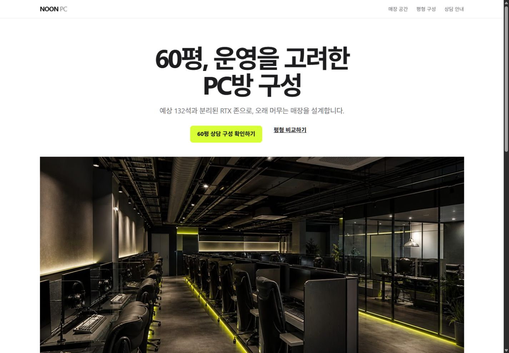

<p align="center"><picture><source media="(prefers-color-scheme: dark)" srcset="docs/assets/brand/genscaff-logo-dark.png"><source media="(prefers-color-scheme: light)" srcset="docs/assets/brand/genscaff-logo-light.png"></picture></p>

# Genscaff

[English](README.md) | [한국어](README.ko.md)

Genscaff is an explicitly invoked Codex plugin for evidence-backed frontend work. The lightweight `$genscaff` skill guides Quick and Standard generation; `$genscaff-release-audit` isolates the expensive Strict release gate. User requirements and the existing design system always outrank its heuristics.

This independent community project is not affiliated with or endorsed by OpenAI.

## Install from the GitHub marketplace

```shell
codex plugin marketplace add gloz9102/genscaff --ref main
codex plugin add genscaff@genscaff-public
```

Restart Codex or open a new task. Neither skill is invoked implicitly.

```text
$genscaff                 # Standard: normal generation and redesign
$genscaff quick           # Quick: a small local change
$genscaff-release-audit   # Strict: release-critical exhaustive audit
$genscaff strict          # v2.0 compatibility route; removed in v2.1
```

## What changed in v2.0.1

- Any user-visible asynchronous boundary must follow a wait-removal-first loading contract, preserve usable context, expose honest status and recovery, and document the observed boundary instead of treating a spinner as completion.
- Standard and Strict reports reject incomplete loading-boundary records; `async` and `generation` Strict work must declare and evidence the loading experience.

## Current frontend workflow

- Schema v6 separates verification `result`, `method`, `coverage`, evidence, issues, and limitations.
- New reports use `IMPLEMENTED_UNVERIFIED`, `VERIFIED_RENDER`, `VERIFIED_PRIMARY_FLOW`, `VERIFIED_KEYBOARD_FLOW`, and `VERIFIED_STANDARD_BASELINE`. Evidence-free booleans or `pass` strings cannot raise status.
- Standard classifies `project_mode`, four reference modes, one primary experience archetype, relevant surface types, and change scope before broad work.
- The product/design contract covers product, reference, content, visual-system, and engineering decisions. Recovery is required only when failure, cancellation, reversal, incompletion, network, or transaction behavior makes it real.
- Six focused craft modules cover product editorial, marketplace discovery, media discovery, workflow applications, content editorial, and transactions.
- Named-site inspiration defaults to principle extraction with deliberate differences, not logo, copy, asset, composition, navigation, geometry, or interaction cloning.
- Product and transaction craft rejects invented selection steps and disabled CTAs as `FABRICATED_FRICTION`.
- Strict uses a compact workflow rubric instead of loading historical AI-slop and brand-research chains.
- The existing deterministic A/B harness still prepares 8-prompt PR suites or 120-run release suites. Its JSON definitions now also include static behavior cases for reference intent, degradation, keyboard, schema migration, and command safety.
- The core skill has no Node, Playwright, or Lighthouse dependency; those remain in release-audit.

Schema v3/v4 Strict reports remain supported by release-audit. Core schema v5 Standard reports remain readable: legacy `VERIFIED_FLOW` maps at most to `VERIFIED_PRIMARY_FLOW`, and `VERIFIED_STANDARD` maps at most to `VERIFIED_KEYBOARD_FLOW` after evidence validation. New reports do not emit legacy names.

## Profiles

| Invocation | Scope | Evidence |
|---|---|---|
| `$genscaff quick` | Small copy, component, or local style change | Affected code; one viewport when needed |
| `$genscaff` | Ordinary generation or redesign | Desktop/mobile render, flow, console, overflow, keyboard and focus |
| `$genscaff-release-audit` | Trusted release-critical frontend | Four checkpoints, full controls, Lighthouse, provenance, independent review |

Genscaff does not ban gradients, glass, blur, or glow. It preserves effects required by the user, a locked reference, or the project system. It is not an authorship detector, originality certificate, or substitute for representative-user testing.

## Classification and references

Reference modes are `locked-reproduction`, `structural-reference`, `aesthetic-inspiration`, and `no-reference`. A supplied screenshot is not automatically locked. Exact reproduction requires an explicit lock scope and rights to supplied assets.

Experience archetypes describe the product job: `product-editorial`, `marketplace-discovery`, `media-discovery`, `workflow-application`, `content-editorial`, or `transaction`. Surface types describe the changed screen, such as `landing`, `search`, `listing`, `detail`, `dashboard`, `form`, or `checkout`.

```text
"Use Apple product-page clarity and pacing, but copy none of its layout,
assets, navigation, copy, typography, or interactions."
→ aesthetic-inspiration / product-editorial / landing

"Use mature Airbnb-like search, comparison, availability, and trust
principles without its branding or component geometry."
→ aesthetic-inspiration / marketplace-discovery / search, listing

"Use mature Netflix-like content-discovery principles with progress,
missing-media handling, and complete keyboard navigation, without copying it."
→ aesthetic-inspiration / media-discovery / landing, listing
```

These classifications guide craft; they do not replace user requirements or an existing information architecture.

## Runtime and approval model

Missing Chrome caps Standard at source implementation without browser evidence; missing Lighthouse blocks only its audit. Missing Strict-only dependencies or a reviewer makes Strict incomplete. Safe source edits continue unless the deliverable itself cannot be produced.

Read-only inspection, project command execution, dependency installation, active browser access, network commands, and destructive operations are separate permissions. A request to modify and test the workspace may authorize inspected non-destructive lint/test/build commands, but not installs, deploys, migrations, credentials, network access, or cleanup. Validation output is scoped evidence, not WCAG conformance or legal/originality certification.

## Same-brief sample

Two independent `terra-medium` agents received the same product-page brief. Only the treatment explicitly invoked Genscaff Standard.

| Genscaff Standard | Control |
|---|---|
|  |  |

Both outputs were usable. This one qualitative pair does not establish superiority; see the [full comparison](docs/slowdrop-comparison.md). v2.0 treats its first scored release run as a baseline rather than a marketing claim.

## Quick anti-slop A/B (directional)

One isolated `gpt-5.6-terra` low-effort pair received the same fictional FlowPilot landing-page brief. The treatment explicitly invoked the current Genscaff Standard Skill; the control could not inspect it. This is directional evidence from two agents, not statistical proof.

| Parent-verified result | Genscaff | Control |
|---|---:|---:|
| Desktop render and primary interaction | Pass | Pass |
| Reliable 390×844 render evidence | Pass | Fail: renderer scaling limitation |
| Valid Standard schema v6 report | Pass | Not produced |
| Lighthouse P/A/BP/SEO | 100/98/100/100 | 100/95/100/100 |
| Remaining generic-default cluster | Yes | Yes, broader |

Genscaff helped by grounding the hero in a concrete approval route, retaining desktop/mobile flow evidence, and producing a validator-clean evidence report. It did not fully solve report honesty: the rendered treatment still contained decorative eyebrow copy, unsupported time-saved/setup claims, and nested workflow-row geometry that its own report did not list. The control combined a gradient hero, decorative eyebrow, nested workflow cards, and a uniform feature-card grid, while its mobile screenshot could not substantiate the requested viewport. The directional verdict is **Genscaff helped, but anti-slop finding recall still needs work**.

## Same-brief Apple-principle PC café comparison

Two independent `gpt-5.6-terra` agents received the [same NOON PC brief](examples/pccafe-apple-comparison/shared-brief.md), the same generated store image, the same standalone HTML constraint, and the same Korean production-copy rule. Only the left treatment invoked Genscaff Standard. Apple was used as an aesthetic-principle reference; neither treatment copies Apple trademarks, assets, copy, or exact layout.

| Genscaff Standard | Control |
|---|---|
|  |  |

Observed differences:

- Genscaff produced a separate visual target and Standard report, a more compact three-option configuration surface, and a larger edge-to-edge image treatment.
- The control put the selected `60평` model and `132석` consequence directly in the hero, then used a longer model-list and result-panel composition.
- Both completed the model-change, required-field error, consultation summary, edit/close recovery, and desktop/mobile overflow checks. Focus styles were checked statically; a full Tab/Enter walkthrough was not claimed. Both final Lighthouse runs scored 100 in Performance, Accessibility, Best Practices, and SEO.
- The Genscaff treatment initially omitted the dialog's team-room value and logged a console error after model change. The shared verification pass found and fixed it before publication. This pair is qualitative evidence, not a claim that either workflow is universally better.

[Open the deployed comparison](https://pccafe-apple-comparison.vercel.app/) · [Genscaff Standard](https://pccafe-apple-comparison.vercel.app/with-genscaff/) · [Control](https://pccafe-apple-comparison.vercel.app/without-genscaff/)

## Repository layout

```text
.agents/plugins/marketplace.json
plugins/genscaff/{.codex-plugin,assets,skills/{genscaff,genscaff-release-audit}}
skill/genscaff/          # frozen v2.0 legacy source; removed in v2.1
evals/                   # cases, rubric, checked-in summaries only
tools/                   # validators, deterministic packaging, eval harness
```

## Validate

Core checks use Python. Strict additionally uses the Node version and production dependencies declared by its bundled manifest plus Chrome/Chromium; the manifest is the runtime source of truth.

```shell
python tools/check_skill.py
python -m unittest discover -s tools -p "test_*.py"
python plugins/genscaff/skills/genscaff/scripts/test_quality_gate.py
npm ci --omit=dev --prefix plugins/genscaff/skills/genscaff-release-audit/scripts
npm audit --omit=dev --audit-level=moderate --prefix plugins/genscaff/skills/genscaff-release-audit/scripts
python plugins/genscaff/skills/genscaff-release-audit/scripts/test_quality_gate.py
python tools/package_skill.py
```

The validator never replays repository commands by default. `--execute-approved-commands` is only for an inspected repository the user explicitly trusts. Active browser audits execute page JavaScript and may make external requests.

## Evaluation harness

```shell
python tools/eval_harness.py prepare --suite pr --model gpt-5.6-terra --reasoning medium --output eval-run
python tools/eval_harness.py run --run-dir eval-run
python tools/eval_harness.py blind --run-dir eval-run
python tools/eval_harness.py score --run-dir eval-run
python tools/eval_harness.py validate --run-dir eval-run
```

Model runs use local Codex authentication, isolated Git workspaces, `codex exec --ephemeral --ignore-user-config --ignore-rules --sandbox workspace-write`, and preserved JSONL traces. Raw runs stay out of Git and belong in release artifacts; only summaries are committed.

## Compatibility packages

`python tools/package_skill.py` creates reproducible `genscaff-plugin.zip` and a one-release `genscaff-legacy.zip`, each with a SHA-256 sidecar. The legacy ZIP and `$genscaff strict` route are removed in v2.1.

## License

Project-owned source and documentation use [Apache License 2.0](LICENSE). See [THIRD_PARTY_NOTICES.md](THIRD_PARTY_NOTICES.md) and [SECURITY.md](SECURITY.md).
