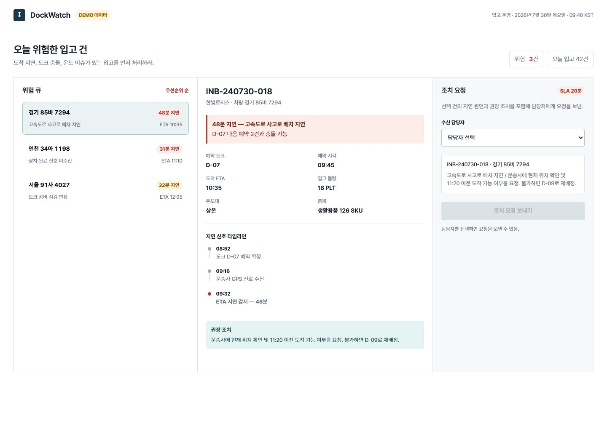
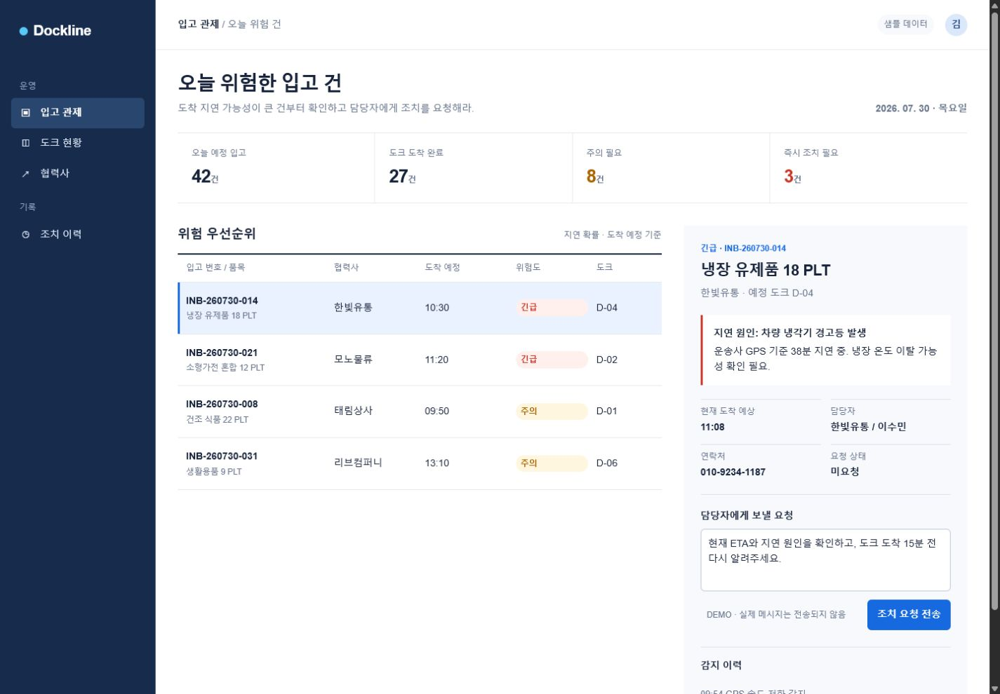

# Genscaff

[English](README.md) | [한국어](README.ko.md)

Genscaff is an evidence-backed Codex skill for building and reviewing browser-rendered frontend work. It preserves user and project design intent while checking product specificity, action continuity, responsive behavior, accessibility basics, and runtime integrity at a verification level appropriate to the task.

This is an independent community project. It is not affiliated with or endorsed by OpenAI.

## Same-brief comparison

Two independent `terra-medium` agents received the same Korean logistics-dashboard brief and implementation constraints. One used Genscaff Standard; the other was explicitly isolated from Genscaff.

| Genscaff Standard | Without Genscaff |
|---|---|
|  |  |

In this sample, the Genscaff run produced a more direct risk-selection-to-action flow and additional verification artifacts. The control run produced a polished, conventional KPI-and-sidebar dashboard. Both were responsive, completed the request/cancel interaction, and had no console errors or warnings during the checked flow.

This is a single qualitative A/B sample, not proof that the skill will outperform every unassisted run. See the [full desktop, mobile, and terminal-state comparison](docs/comparison.md) for the brief, controls, observations, and limitations.

## Verification profiles

| Profile | Use | Required verification |
|---|---|---|
| **Quick** | Explicitly requested small copy, component, or local style changes | Affected code and an optional representative viewport |
| **Standard** | Default for normal generation and redesign work | Desktop/mobile primary flow, console, overflow, focus, and accessibility basics |
| **Strict** | Explicit release-critical or exhaustive verification | Full live-browser, control, content, Lighthouse, capture, and independent-review evidence |

Genscaff does not ban gradients, glass, or blur as technologies. User requirements and established project design win. Standard warns about unexplained decorative clichés; Strict requires detected effects to be removed or justified with user/project provenance.

Genscaff is not an AI-authorship detector, originality certificate, or replacement for representative-user testing.

## Repository layout

```text
.
├── skill/genscaff/        # Installable Codex skill
├── tools/                 # Repository validation and packaging
├── docs/                  # Evaluation notes and comparison evidence
├── .github/workflows/     # CI
├── LICENSE                # Apache License 2.0
├── NOTICE
└── THIRD_PARTY_NOTICES.md
```

The repository documentation stays outside the installable skill so the skill only carries execution instructions, bundled resources, and legally required notices.

## Requirements

- Python 3.10 or newer
- Node.js 22.19 or newer
- Chrome or Chromium
- npm access for the browser-audit dependencies

## Install

Back up an existing `genscaff` installation before replacing it.

### Windows PowerShell

```powershell
Copy-Item -Recurse .\skill\genscaff "$env:USERPROFILE\.codex\skills\genscaff"
npm ci --omit=dev --prefix "$env:USERPROFILE\.codex\skills\genscaff\scripts"
```

### macOS or Linux

```shell
cp -R skill/genscaff "$HOME/.codex/skills/genscaff"
npm ci --omit=dev --prefix "$HOME/.codex/skills/genscaff/scripts"
```

Restart Codex or open a new task, then invoke `$genscaff`.

## Validate and test

```shell
python tools/check_skill.py
npm ci --omit=dev --prefix skill/genscaff/scripts
npm audit --omit=dev --audit-level=moderate --prefix skill/genscaff/scripts
python skill/genscaff/scripts/test_quality_gate.py
```

The full regression suite starts real browser and Lighthouse processes. Set `CHROME_PATH` when Chrome cannot be discovered automatically.

## Safe validation

Repository scripts are arbitrary code even when named `test`, `lint`, or `build`. The validator does not re-run them by default. Only use `--execute-approved-commands` after inspecting the exact commands and trusting the repository.

Strict browser validation executes target-page JavaScript and may make network requests. It requires `--allow-active-browser-audit` and, for schema v4 reports, `execution_policy.active_browser=approved`. Do not expose credentials or secrets to an untrusted target.

```shell
python skill/genscaff/scripts/quality_gate.py --init report.json --profile standard
python skill/genscaff/scripts/quality_gate.py --init strict-report.json --profile strict
python skill/genscaff/scripts/quality_gate.py --report strict-report.json --allow-active-browser-audit
```

Schema v3 reports remain supported as `legacy-strict`.

## Build an installable archive

```shell
python tools/package_skill.py
```

This creates `dist/genscaff.zip` and `dist/genscaff.zip.sha256`. The archive contains a top-level `genscaff/` directory ready to copy into the Codex skills directory.

## Publish the repository

Review `NOTICE` and replace the collective copyright label with your preferred legal name or GitHub handle if desired. Then publish from the repository root:

```shell
git init
git add .
git commit -m "feat: publish genscaff skill"
git branch -M main
gh repo create genscaff --public --source=. --remote=origin --push
```

The last command creates public external state. Inspect the staged files and repository visibility before running it.

## Contributing

Read [CONTRIBUTING.md](CONTRIBUTING.md). Contributions are accepted under the same Apache-2.0 terms as the repository.

## License

Project-owned source and documentation are licensed under the [Apache License 2.0](LICENSE). Third-party components and cited external materials remain subject to their own terms; see [THIRD_PARTY_NOTICES.md](THIRD_PARTY_NOTICES.md).
