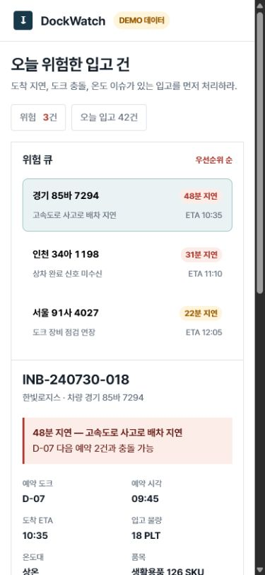
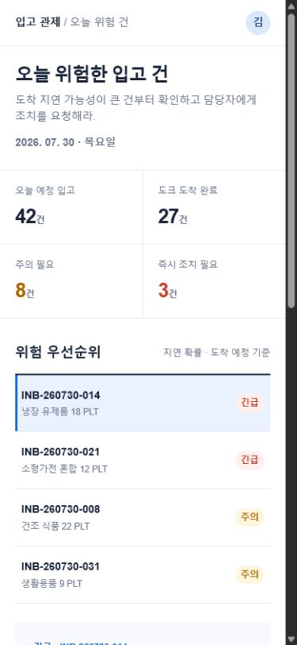
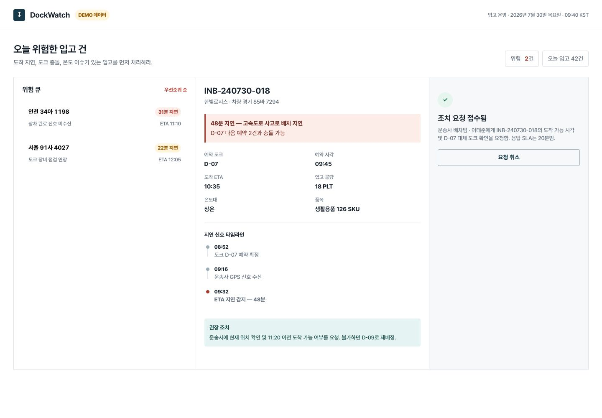
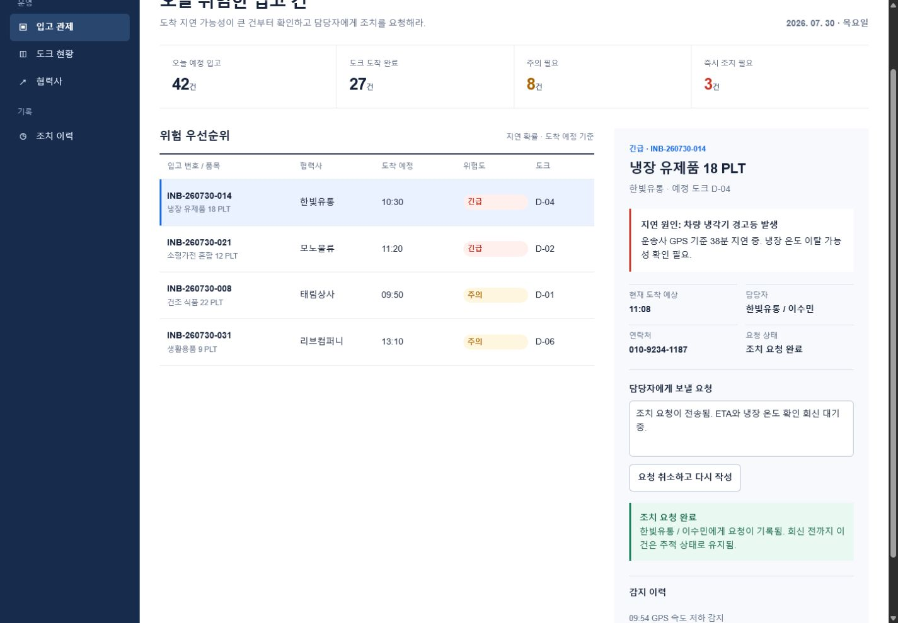

# Same-brief comparison

[English](comparison.md) | [한국어](comparison.ko.md)

This page records one qualitative A/B run conducted on July 30, 2026. It is intended as inspectable evidence, not a benchmark or a causal claim.

## Setup

| Control | Value |
|---|---|
| Model | Two independent `terra-medium` agents |
| Brief | Build a responsive operations dashboard for identifying delayed warehouse receipts, inspecting causes, and requesting action from an owner |
| Implementation | Self-contained HTML, CSS, and JavaScript; Korean copy; no external dependencies or assets |
| Treatment | One agent used Genscaff Standard; the control agent did not read or use Genscaff |
| Browser checks | Desktop and mobile layout, request/cancel flow, console errors and warnings |

## Desktop initial state

| Genscaff Standard | Without Genscaff |
|---|---|
|  |  |

## Mobile initial state

| Genscaff Standard | Without Genscaff |
|---|---|
|  |  |

## Request-complete state

| Genscaff Standard | Without Genscaff |
|---|---|
|  |  |

## Observations

- The Genscaff result emphasized one continuous workflow: select a risk, inspect the cause, assign an owner and SLA, send the request, and recover by canceling it.
- The control result emphasized conventional dashboard navigation, KPI summaries, and a broader operations shell.
- Both results were responsive and functional. The checked flows produced no browser console errors or warnings.
- The Genscaff run also produced a visual target and verification notes; the control run produced only the implementation.

## Limitations

This comparison has one sample per condition. Independent agent variation, generation randomness, and subjective design judgment remain confounders. The screenshots demonstrate the outputs of this run; they do not establish that Genscaff always produces a better-looking interface or that the observed differences were caused only by the skill.
