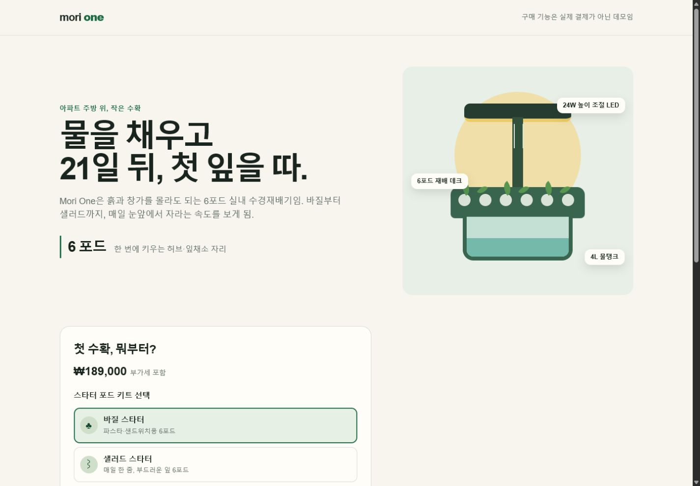
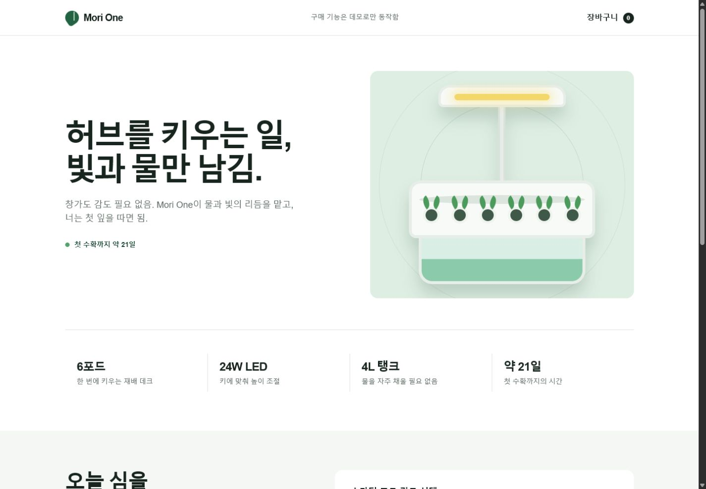
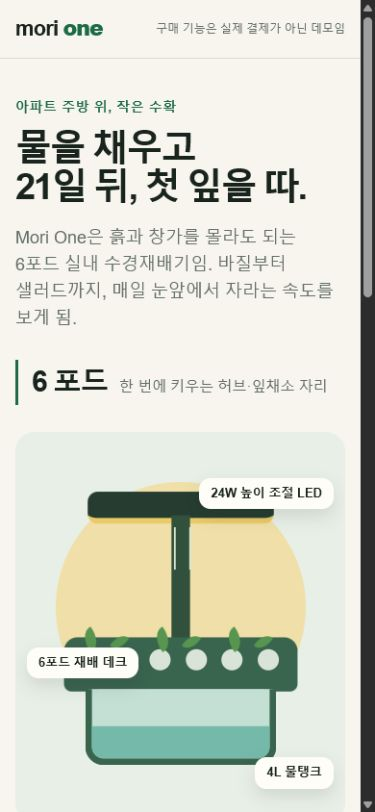
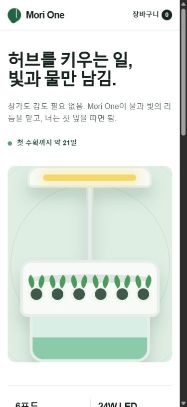
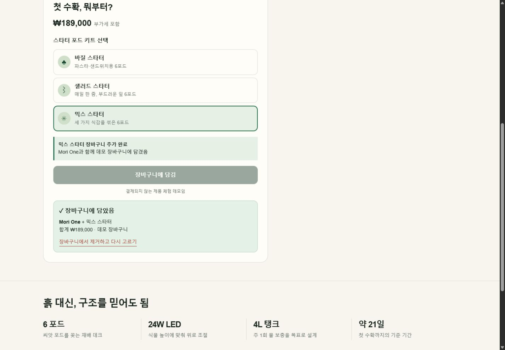
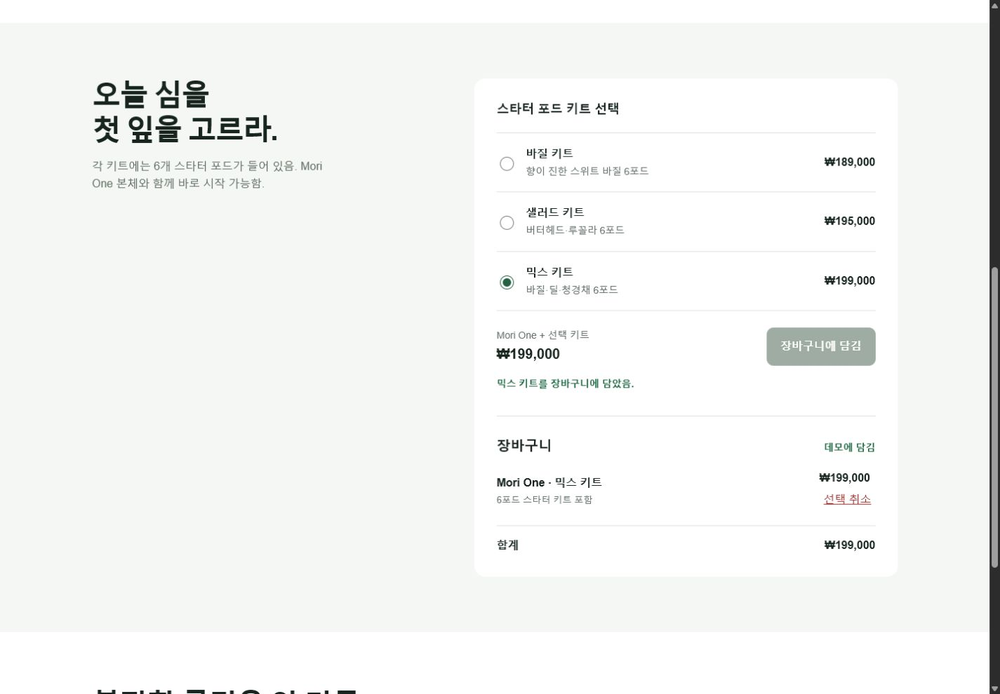

# Product-page same-brief comparison

[English](product-page-comparison.md) | [한국어](product-page-comparison.ko.md)

This page records one qualitative A/B run conducted on July 31, 2026. It is inspectable evidence from one run, not a benchmark or a causal claim.

## Setup

| Control | Value |
|---|---|
| Model | Two independent `terra-medium` agents |
| Brief | Introduce the fictional Mori One indoor hydroponic garden, explain its 6-pod deck, 24W adjustable LED, 4L tank, and approximate 21-day first harvest, then let the user choose a basil, salad, or mixed starter kit |
| Primary flow | Select the mixed kit, add it to a demo cart, observe the cart summary, then remove it and recover the initial state |
| Implementation | One self-contained HTML/CSS/JavaScript file per condition; Korean copy; no external dependencies, assets, fonts, or network requests |
| Treatment | One agent used Genscaff Standard; the control agent did not read or use Genscaff |
| Browser checks | CSS viewports 1440×1000 and 390×844, horizontal overflow, primary flow, recovery, and console errors or warnings |

The Genscaff run created a product contract, visual target, and verification notes. Its first browser capture exposed a CSS class collision and Korean word-breaking defects; the same agent corrected both through two evidence-driven iterations. The control result passed the root visual check without a revision.

## Desktop initial state

| Genscaff Standard | Without Genscaff |
|---|---|
|  |  |

## Mobile initial state

| Genscaff Standard | Without Genscaff |
|---|---|
|  |  |

## Cart terminal state

| Genscaff Standard | Without Genscaff |
|---|---|
|  |  |

## Observations

- The Genscaff result placed annotated product hardware and the starter-kit decision close to the hero, making product details and the primary task tightly connected.
- The control result used a more conventional premium-commerce hierarchy, with a cleaner first-view composition, a persistent cart count, and distinct kit prices.
- The Genscaff evidence loop caught and corrected defects that static inspection missed: overlapping diagram labels and awkward Korean word breaks on mobile.
- Both results exposed all four required specifications, completed the checked selection/add/remove flow, avoided horizontal overflow, and produced no checked console errors or warnings.

## Limitations

This comparison has one sample per condition, one fictional product, and subjective visual judgment. Independent agent variation and generation randomness remain confounders. The revision count was asymmetric because only the Genscaff result showed visible defects in the first root capture. These screenshots demonstrate this run; they do not establish that either condition will always produce better product pages or that the differences were caused only by Genscaff.
