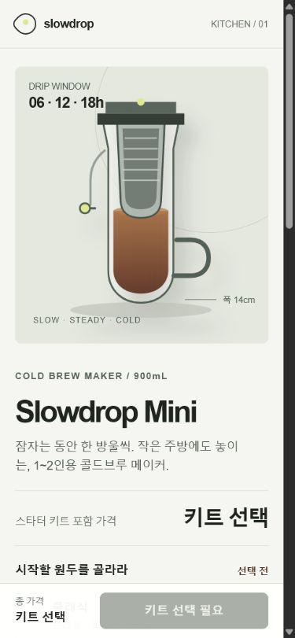
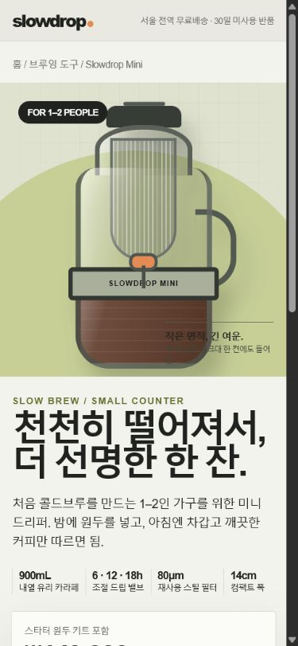
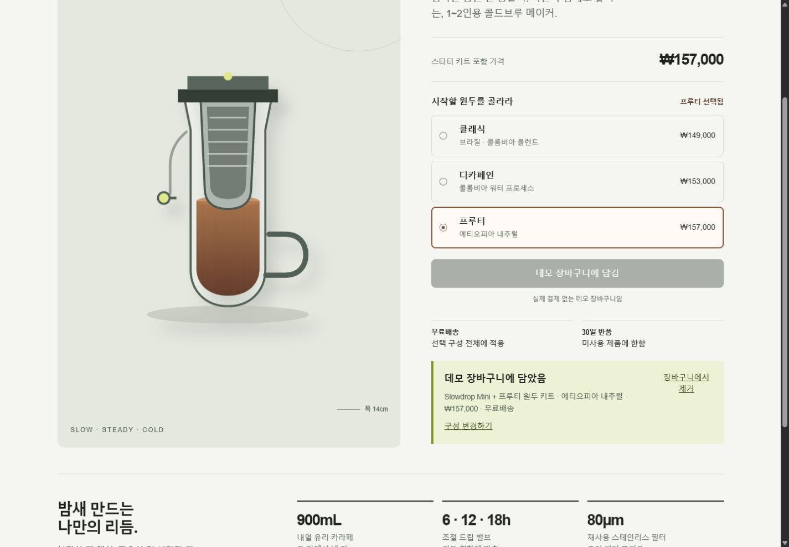
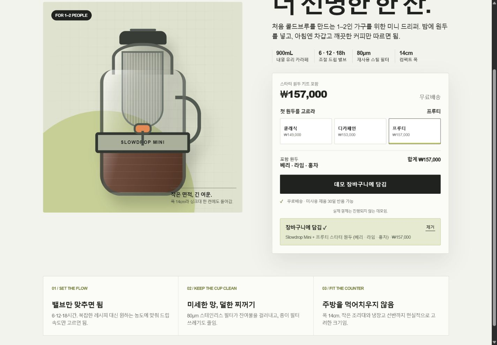

# Product-page same-brief comparison

[English](slowdrop-comparison.md) | [한국어](slowdrop-comparison.ko.md)

This document records one qualitative A/B run performed on July 31, 2026. It is reviewable evidence, not a benchmark or proof of causation.

The historical treatment used the legacy `product-commerce` route. The current classifier would inspect the actual purchase task before choosing `transaction` or `marketplace-discovery` and would record the relevant `detail`/`checkout` surfaces; this note does not rescore the run.

## Conditions

| Control | Value |
|---|---|
| Model | Two independent `terra-medium` agents |
| Brief | A responsive Korean product page for the fictional Slowdrop Mini cold-brew maker, aimed at one- or two-person households and small kitchens |
| Product facts | 900 mL heat-resistant glass carafe, 6/12/18-hour valve, reusable 80 μm stainless filter, 14 cm width, free shipping, and 30-day returns for unused products |
| Purchase flow | Three starter kits with immediate bean and total updates, demo-cart add, clear terminal summary, remove, and recovery |
| Implementation | One self-contained HTML/CSS/JavaScript file with no external libraries, fonts, images, or network requests |
| Treatment | One agent used Genscaff Standard with the product-commerce route; the control agent was instructed not to read or use Genscaff |
| Browser check | 1440×1000 desktop and 390×844 mobile; option change, add, remove/recovery, console warnings/errors, and horizontal overflow |

## Desktop start state

| Genscaff Standard | Without Genscaff |
|---|---|
|  |  |

## Mobile start state

| Genscaff Standard | Without Genscaff |
|---|---|
|  |  |

## Add-to-cart terminal state

| Genscaff Standard | Without Genscaff |
|---|---|
|  |  |

## Observations

- Both outputs are visually coherent and specific to the same compact cold-brew product. This run does not support a claim that the Genscaff output is categorically more attractive.
- The Genscaff output begins with no kit selected, disables purchase until the user makes a choice, explains shipping and return conditions next to the decision, and exposes both remove and change-configuration recovery actions after adding.
- The control output preselects the Classic kit and presents a bolder editorial hero with a more immediate enabled purchase action. Its terminal state is compact and still supports removal.
- Both outputs updated the Fruity kit to KRW 157,000, preserved the selection after removal, passed the tested desktop and mobile flows, emitted no console warnings or errors, and showed no horizontal overflow.
- The Genscaff run also produced a visual target and a verification record. The control run produced only the implementation file.

## Verification and limitations

The same root reviewer exercised both pages in the same in-app browser and viewport sizes. Neither page required a correction after the first visual and interaction pass. A single sample per condition cannot isolate the skill from independent-agent variation, generation randomness, or subjective design judgment. These screenshots show what happened in this run; they do not establish that Genscaff always produces a better-looking page or that every observed difference was caused by the skill.
