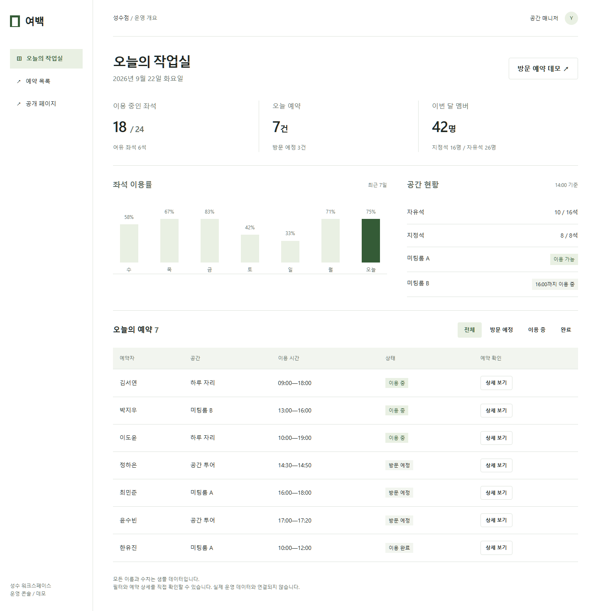
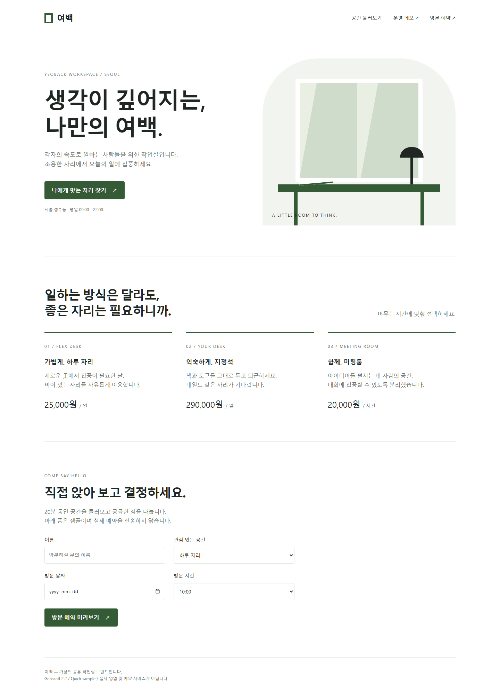
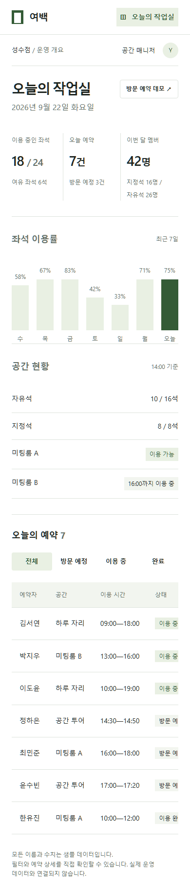
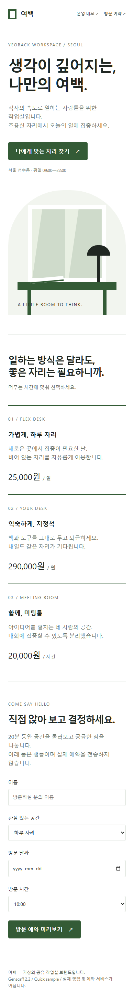

# Genscaff 2.2 Quick 예시

[English](v2.2-quick-examples.md) | [한국어](v2.2-quick-examples.ko.md) | [README](../README.ko.md)

사용자의 명시적인 Genscaff 2.2 Quick 요청으로 제작한 샘플입니다. 가상의 공유 작업실 브랜드 여백, CSS 토큰, 독립 HTML 구조를 공유합니다. 이 시연은 좁은 수정에 적용하는 일반적인 Quick 범위를 변경하거나 스킬의 비교 우위를 입증하지 않습니다.

## 대시보드

[대시보드 소스](../examples/v2.2-quick/dashboard.html)

좌석 사용량, 당일 예약, 멤버 수, 최근 7일 이용률, 공간 현황을 함께 보여줍니다. 예약 필터를 선택하면 목록과 건수가 변경됩니다. 상세 버튼은 네이티브 대화상자를 열며, Escape로 닫으면 기존 버튼으로 초점이 돌아갑니다.



## 랜딩페이지

[랜딩페이지 소스](../examples/v2.2-quick/landing.html)

첫 소개, 공간 선택, 방문 폼을 별도 섹션으로 나누고 여백을 유지합니다. 주요 링크는 공간 소개로 이동합니다. 폼은 필수 입력값을 검사하고 방문 일정 미리보기를 표시합니다. 예약이나 개인정보를 백엔드에 전송하지 않습니다.



## 모바일

| 대시보드 | 랜딩페이지 |
|---|---|
|  |  |

대시보드 표는 자체 영역 안에서 가로로 스크롤합니다. 페이지 전체의 가로 넘침은 없습니다. 랜딩페이지의 섹션과 폼 필드는 세로로 배치합니다.

## 실행과 색상 변경

저장소 루트에서 실행합니다.

```shell
python -m http.server 8822 --bind 127.0.0.1 --directory examples/v2.2-quick
```

[대시보드](http://127.0.0.1:8822/dashboard.html) 또는 [랜딩페이지](http://127.0.0.1:8822/landing.html)를 엽니다. 로컬 서버가 실행 중일 때만 접근할 수 있으며 공개 배포 주소가 아닙니다.

[styles.css](../examples/v2.2-quick/styles.css)의 `:root`에서 포인트 색상과 hover, 누름, 전경색, 옅은 배경색 토큰을 변경할 수 있습니다. 변경 후에는 대비를 다시 확인합니다. 페이지를 보는 데 프런트엔드 빌드나 외부 이미지 다운로드는 필요하지 않습니다.

## 검증 범위

저장소에 설치된 Playwright를 사용해 [검증 스크립트](../examples/v2.2-quick/verify.cjs)를 1440×1050과 390×844에서 실행했습니다. 페이지 가로 넘침, 콘솔 오류, 페이지 오류, 예약 필터, 상세 창, Escape, 초점 복귀, 섹션 이동, 폼 결과, 모션 감소 설정을 확인했습니다. 스크린샷을 직접 확인했으며 모바일 필터 줄바꿈을 수정한 뒤 다시 검사했습니다.

```shell
node examples/v2.2-quick/verify.cjs
```

검증에는 스크립트가 참조하는 경로의 Playwright와 Chromium이 필요하지만 페이지 열람에는 필요하지 않습니다. [검증 기록](../examples/v2.2-quick/verification.md)과 [캡처 파일](../examples/v2.2-quick/artifacts/)에서 근거를 확인할 수 있습니다.

모든 이름과 운영 데이터는 가상입니다. Lighthouse, 전체 키보드 감사, 보조공학 검사, 백엔드 연동, A/B 비교 평가는 실행하지 않았습니다. Standard 또는 Strict 인증 결과가 아닙니다.
