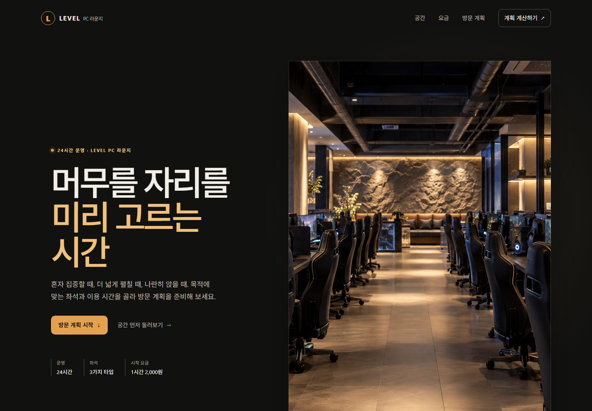
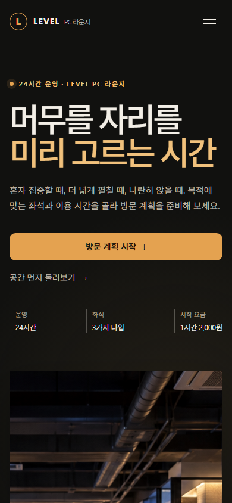

# Genscaff v2.2.5 PC cafe landing comparison

[한국어](v2.2.5-pccafe-comparison.ko.md) | [README](../README.md)

Two independent agents built fictional LEVEL PC Lounge from the same brief. Only one used Genscaff Standard. These are final, corrected samples from one pair, not proof of general skill effectiveness.

## Conditions

- Both agents used `gpt-5.6-luna` with `xhigh` reasoning, fresh separate directories, the same [brief](../examples/v2.2.5-pccafe-comparison/brief.md), and the same [generated image](../examples/v2.2.5-pccafe-comparison/assets/cafe-hero.png).
- They started without conversation history and were forbidden from inspecting sibling results. File isolation was instructional, not an enforced security boundary.
- The treatment read Genscaff v2.2.5 Standard and its routed references. The control used no frontend design skill. Design selection was delegated.
- The parent ran matching functional checks, inspected screenshots, and requested accessibility and text-wrapping corrections. No preference-driven redesign was requested.

## Desktop

Chromium, 1440×1000, device scale factor 1.

| Standard applied | Without Genscaff |
|---|---|
|  |  |

## Mobile

390×844 with touch emulation, not a physical mobile device.

| Standard applied | Without Genscaff |
|---|---|
|  |  |

## Full pages and interaction evidence

| Capture | Standard | Control |
|---|---|---|
| Full desktop | [Image](../examples/v2.2.5-pccafe-comparison/artifacts/standard-desktop-full.png) | [Image](../examples/v2.2.5-pccafe-comparison/artifacts/control-desktop-full.png) |
| Full mobile | [Image](../examples/v2.2.5-pccafe-comparison/artifacts/standard-mobile-full.png) | [Image](../examples/v2.2.5-pccafe-comparison/artifacts/control-mobile-full.png) |
| Hover | [Image](../examples/v2.2.5-pccafe-comparison/artifacts/standard-desktop-hover.png) | [Image](../examples/v2.2.5-pccafe-comparison/artifacts/control-desktop-hover.png) |
| Keyboard focus | [Image](../examples/v2.2.5-pccafe-comparison/artifacts/standard-desktop-focus.png) | [Image](../examples/v2.2.5-pccafe-comparison/artifacts/control-desktop-focus.png) |
| Mobile menu | [Image](../examples/v2.2.5-pccafe-comparison/artifacts/standard-mobile-menu.png) | [Image](../examples/v2.2.5-pccafe-comparison/artifacts/control-mobile-menu.png) |
| Mobile confirmation | [Image](../examples/v2.2.5-pccafe-comparison/artifacts/standard-mobile-confirmation.png) | [Image](../examples/v2.2.5-pccafe-comparison/artifacts/control-mobile-confirmation.png) |

## Observations and corrections

Standard uses an amber accent, restrained surfaces, and inline plan confirmation. Control uses lime accents, large italic emphasis, colored seat panels, and a confirmation modal. Both implement the requested calculator and editable preview.

Parent inspection found desktop word splitting and hidden mobile-menu keyboard handling to correct in Standard. Standard small secondary text also received a contrast correction. Control had emphasized text on light backgrounds at 1.10:1 and 2.41:1 contrast; corrected values were 6.19:1 and 5.54:1. Reduced-motion behavior for scrolling from the control modal was also checked.

The displayed results include these interventions. They are not untouched first generations. No functional winner or general visual-quality improvement is claimed. Color and composition preferences can be assessed separately.

Standard retains [candidate A](../examples/v2.2.5-pccafe-comparison/standard/candidate-a-desktop.png), [candidate B](../examples/v2.2.5-pccafe-comparison/standard/candidate-b-desktop.png), and its [contract](../examples/v2.2.5-pccafe-comparison/standard/contract.md). Candidate captures were completed after the full implementation, so they do not establish that rendered selection happened before implementation. The [control decisions](../examples/v2.2.5-pccafe-comparison/control/decisions.md) are also retained.

## Reproduce

| Shared checks | Standard | Control |
|---|---|---|
| Desktop/mobile images, horizontal overflow, runtime errors | Passed | Passed |
| Nine prices per viewport, confirmation and editing | Passed | Passed |
| Tab → arrow selection → Enter confirmation → edit | Passed | Passed |
| Confirmation focus occlusion, hover feedback and pointer-out restoration | Passed | Passed |
| Emulated touch menu, primary link, CSS reduced motion | Passed | Passed |

These results cover the specified paths and states, not every control or every mobile browser.

Secondary source metrics: both ship three HTML/CSS/JS files. Standard totals 33,792 bytes and 503 lines; control totals 37,813 bytes and 370 lines. Shared imagery, verification scripts, candidates, and documentation are excluded. Formatting affects these counts; they are not quality scores.

Run from the repository root:

```shell
python -m http.server 8835 --bind 127.0.0.1 --directory examples/v2.2.5-pccafe-comparison
```

Open the [comparison](http://127.0.0.1:8835/). The pages require no frontend build.

The browser checks use the existing release-audit Playwright and Chromium runtime. With that runtime available:

```shell
node examples/v2.2.5-pccafe-comparison/verify.cjs
```

[Raw shared verification](../examples/v2.2.5-pccafe-comparison/artifacts/verification.json) records image loading, horizontal overflow, all nine seat/time prices, confirmation and editing, Tab/arrow/Enter paths, focus occlusion, hover/pointer-out, touch menu, reduced motion, and runtime errors separately.

Physical devices, screen readers, full accessibility conformance, representative-user preferences, and the 120-run release evaluation were not tested. Neither page submits bookings or payments. The venue is fictional and the hero is generated concept imagery; [tool and prompt provenance](../examples/v2.2.5-pccafe-comparison/assets/provenance.md) is retained.
